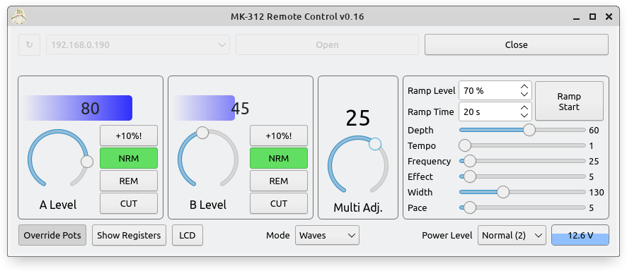

# mk312-gui

Qt python program for controlling the mk-312 box. Compatible with legacy encrypted RS232 link cable, or the newer ESP based [MK312 Wi-Fi bridge](https://github.com/Rangarig/MK312WIFI). A script written in LUA language is also provided for using video subtitles in [mpv](https://github.com/mpv-player/mpv) as a video-synchronized remote control.

